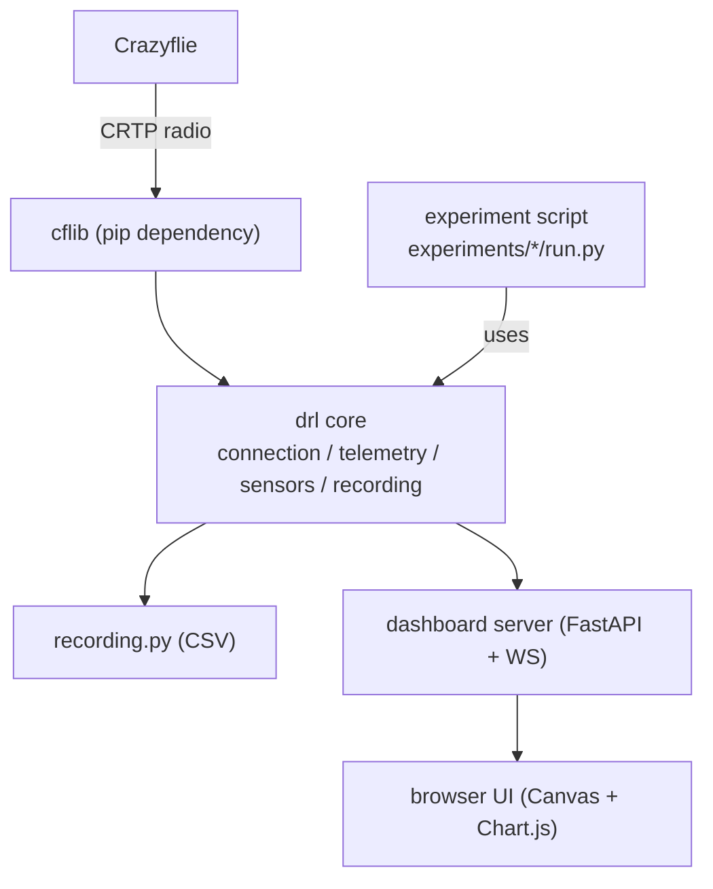
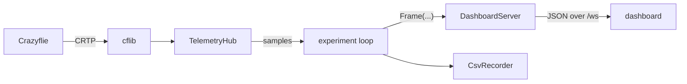

# AGENTS.md

This file orients AI coding agents and human readers to this repository. It explains what the project is, how it is organized, and the guidance to follow when working here.

## Overview

Drone Research Lab is a Python research platform for running flight and sensing experiments on a [Bitcraze Crazyflie](https://www.bitcraze.io/) nano-quadcopter. It pairs a small reusable core library with standalone experiment runners and a live browser dashboard (FastAPI + websockets) for telemetry and visualization.

## Stack

- Language: Python 3.10+
- Drone link: `cflib` (official Bitcraze Crazyflie library) over a Crazyradio 2.0
- Dashboard backend: FastAPI + uvicorn, served on a background thread
- Dashboard frontend: vanilla JS, HTML Canvas, and Chart.js under `drl/dashboard/static/`
- Numerics: NumPy; optional offline analysis via pandas + matplotlib (`analysis` extra)
- Packaging: setuptools via `pyproject.toml`; the core installs editable with `pip install -e .`

## Repository Layout

```
drl/            reusable core library
experiments/    runnable experiment scripts
scripts/        setup and diagnostic utilities
tests/          offline pytest suite
```

## Architecture

Drone Research Lab separates a small reusable core (the `drl` package) from experiments (standalone scripts under `experiments/`). The core handles everything that every experiment needs; experiments add only their own logic.



The core package (`drl/`) is installable and import-only. Experiments live under `experiments/` and read like standalone demos. The dashboard runs on a background thread; experiments call `server.publish(Frame(...))` from anywhere and the frame is broadcast to every connected browser as JSON.

### Core modules

| Module | Responsibility |
|--------|----------------|
| `drl.config` | URI + server + telemetry defaults, all environment-overridable. |
| `drl.connection` | `connect()` context manager around cflib's `SyncCrazyflie`: driver init, arm, estimator reset, deck detection. |
| `drl.telemetry` | `LogConfig` builders + `TelemetryHub`, which fans incoming samples out to subscribers and keeps the latest sample per block. |
| `drl.motion` | `VelocityFlight`: takeoff/land lifecycle and world-frame velocity setpoints with a setpoint keepalive thread. |
| `drl.sensors.ranger` | Normalizes raw Multi-ranger millimeters into meters/`None` (`RangerReading`, `RangerStream`). |
| `drl.recording` | `CsvRecorder`: append any telemetry dict to a timestamped CSV. |
| `drl.dashboard` | `DashboardServer` (FastAPI + websocket, runs on a background thread, broadcasts frames) plus the browser UI under `static/`. |
| `drl.viz` | Optional matplotlib helpers for static figures (the `analysis` extra). |

### Data flow



cflib delivers log data on its own threads. The experiment subscribes to the `TelemetryHub`, transforms samples into dashboard **frames**, and publishes them. `DashboardServer.publish()` is thread-safe: it marshals the frame onto the server's asyncio loop with `run_coroutine_threadsafe` and broadcasts to all connected websockets. The latest frame of each `type` is cached and replayed to clients that connect mid-run.

### Frame protocol

Every websocket message is:

```json
{ "type": "ranger", "ts": 1718600000.12, "payload": { ... } }
```

The browser UI (`drl/dashboard/static/js/`) switches on `type`:

| `type` | payload | rendered as |
|--------|---------|-------------|
| `meta` | `{ experiment }` | header label |
| `ranger` | `{ front, back, left, right, up, down }` meters or `null` | radial HUD + chart |
| `state` | `{ x, y, z, roll, pitch, yaw }` | state readout |
| `cmd` | `{ vx, vy, label }` body-frame m/s | command vector |
| `map` | `{ res, width, height, origin, data, pose, points, pose_raw, trail }` | occupancy grid |
| `estimate` | `{ <channel>: { raw, filtered } }` | raw vs. filtered traces |
| `traj` | `{ reference, estimate, command }` | reference-vs-actual path |
| `cloud` | `{ points: [[x, y, z], ...] }` | 3-D point cloud |
| `battery` | `{ vbat }` volts | top-bar battery readout |

### Adding an experiment

1. Create `experiments/<name>/run.py` (and an empty `experiments/<name>/__init__.py` so it is an importable package).
2. Import the core directly. With the core installed via `pip install -e .` and the experiment run as a module (`python -m experiments.<name>.run`), both `drl` and `experiments.common` resolve normally:

   ```python
   from experiments.common import install_stop_handler
   from drl.connection import connect
   from drl.dashboard import DashboardServer, Frame
   from drl.telemetry import TelemetryHub, make_ranger_config
   ```

3. Start a `DashboardServer`, open a `connect()` link, register log configs on a `TelemetryHub`, and `server.publish(Frame(type, payload))` from your loop or from telemetry callbacks.
4. If you invent a new frame `type`, add a small renderer module under `drl/dashboard/static/js/` and register it in `main.js` (and, if needed, a panel in `index.html`).

### Architecture Rules

- The `drl/` core is reusable and import-only. It should not depend on any single experiment.
- Experiments live under `experiments/<name>/run.py` and read like standalone demos; they add only their own logic and import the core directly.
- Run experiments and scripts as modules from the repo root (`python -m experiments.<name>.run`) so `drl` and `experiments.common` resolve without path hacks.
- The dashboard runs on a background thread. Publish data with `server.publish(Frame(type, payload))`; `DashboardServer.publish()` is thread-safe and broadcasts JSON to all connected browsers.
- Every websocket message follows the frame protocol: `{ "type", "ts", "payload" }`. Known types are `meta`, `ranger`, `state`, `cmd`, `map`, `estimate`, `traj`, `cloud`, and `battery` (see the frame protocol table above).
- A new frame `type` needs a matching renderer under `drl/dashboard/static/js/`, registered in `main.js` (and a panel in `index.html` if needed).
- Heavy payloads (the occupancy `map`) are published from a dedicated rate-limited thread so they never block sensor callbacks.

## Threading Model

- Main thread: the experiment loop (often blocking, e.g. a timed control loop or waypoint following via `VelocityFlight`).
- cflib threads: deliver telemetry log callbacks; `TelemetryHub` fans them out to subscribers.
- Dashboard thread: the uvicorn event loop serving HTTP + websockets.
- Optional helper threads: `VelocityFlight` resends the latest velocity setpoint; `MapPublisher` broadcasts occupancy maps at a fixed rate without blocking telemetry callbacks.

## Recordings & Analysis

- Experiments stream telemetry to timestamped CSVs under `data/` via `drl.recording.CsvRecorder`. The `data/` folder is gitignored, so recorded runs are never committed.
- The SLAM experiment can also dump its raw log-odds grid with `--save-map map.npz` (NumPy `.npz`) and its point cloud with `--save-cloud room.ply` for offline re-plotting without a live drone.
- Offline analysis and plotting depend on the optional `analysis` extra (`pip install -e ".[analysis]"`), which adds pandas + matplotlib. The `drl.viz` matplotlib helpers are gated behind this extra; keep them out of the import-only core path.

## Environment Notes

Configuration is environment-overridable so experiments stay portable across machines and radios (see `drl/config.py`):

- `DRL_URI` (or `CFLIB_URI`): Crazyflie radio URI, defaults to `radio://0/80/2M/E7E7E7E7E7`
- `DRL_HOST`: dashboard bind host, defaults to `127.0.0.1`
- `DRL_PORT`: dashboard port, defaults to `8000`

Hardware/driver notes:

- On Windows the Crazyradio may need the Zadig USB driver; on Linux see cflib's udev rules.
- Do not assume a Crazyflie or Crazyradio is connected when verifying a change. Prefer `python -m scripts.dashboard_demo` for UI work, dry-run / no-fly paths, and local logic checks unless the task explicitly requires live hardware.
